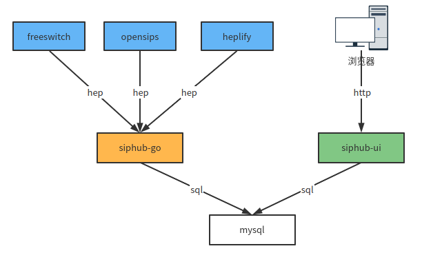
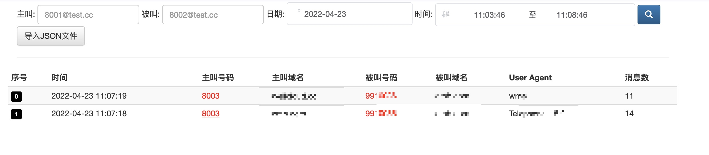
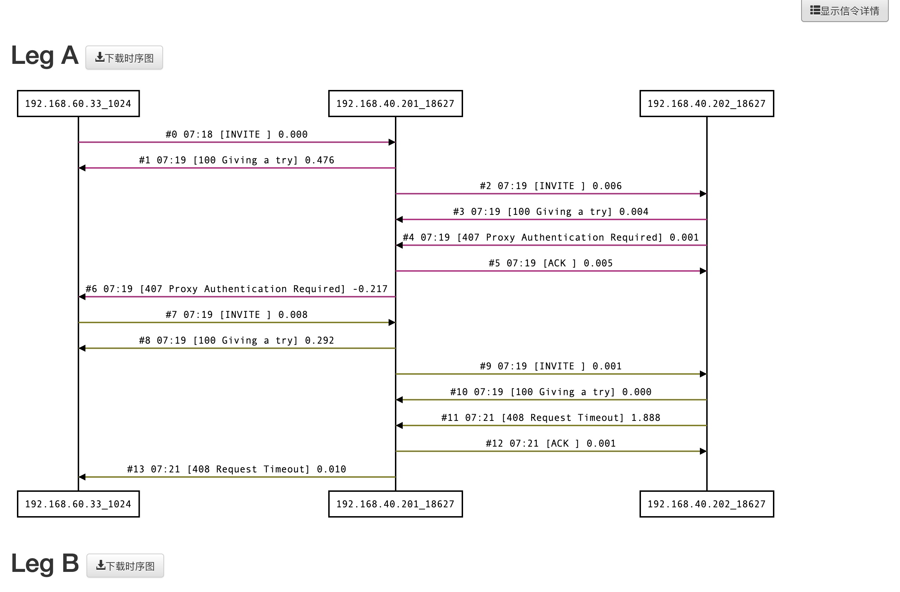
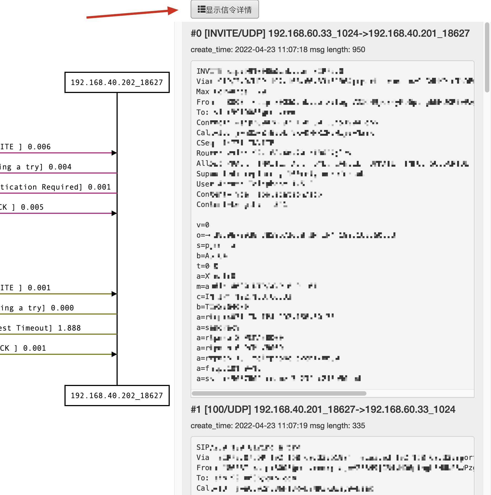
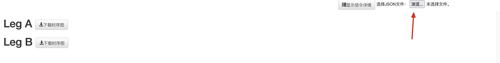

# 1. 架构



# 2. 界面展示

## 2.1 搜索界面

- 搜索页面支持主叫和被叫以及时间范围进行搜索
    - 主叫精确查询；可以不带域名搜索，8001；也可以带域名搜索,8001@test.cc; 也可以只搜搜域名，如@test.cc
    - 被叫是后缀匹配查询； 可以带域名; 也可以不带域名； 也可以只带域名查询
- UID颜色相同表示为两个相关的call-leg
- 导入JSON文件按钮，用来导入并展示在其他环境导出的JSON信令
- 紧接着是一个查询出来的列表



## 2.2 时序图展示界面

- 时序图展示页面默认不会显示具体的SIP信令原始消息
- 支持通过UID关联的call-leg在同一个页面展示
- 每个Call-leg都可以下载时序图，时序图为JSON文件，可以用来在导入并展示
- 点击展示信令详情后，可以看到每个信令的原始SIP信息





## 2.3 时序图文件导入页面

在搜索首页，点击导入JSON文件按钮，会跳转到如下的页面。在这个页面，点击浏览按钮，选择文件。

然后选之前导出的JSON文件，时序图就可以渲染出来。




# siphub 组件
- siphub-go: 负责处理hep消息，写入数据库 
- siphub-ui: 负责web界面展示，数据搜索

# Golang版本

- 仅支持hep3协议

# 功能介绍

## mysql安装

先准备一个mysql数据库，并自行创建一个名为siphub的数据库。

## siphub-go

docker 安装siphub-go

```bash
    docker run -d \
    --name siphub-go \
    -p 3000:3000 \
    -p 9060:9060/udp \
    -e DBAddr="localhost" \
    -e DBUserPasswd="root:password" \
    -e DBName="siphub" \
    -e LogLevel="info" \
    -e HeaderUIDName="X-UID" \
    wangduanduan/siphub-go:21.12.16
```

- 3000/HTTP 端口
    - GET /metrics/prometheus 提供普罗米修斯统计的监控接口
- 9060/UDP hep消息接收端口

- siphub-go环境变量说明

```
    // UDP监听端口
	UDPListenPort         int    `env:"UDPListenPort" envDefault:"9060"`
    // 最大UDP包的长度
	MaxPackgeLength       int    `env:"MaxPackgeLength" envDefault:"2048"`
    // UDP读取超时秒数
	MaxReadTimeoutSeconds int    `env:"MaxReadTimeoutSecond" envDefault:"5"`
    // 日志级别
	LogLevel              string `env:"LogLevel" envDefault:"debug"`
    // 主机名称
	Hostname              string `env:"HOSTNAME" envDefault:"unknow"`
    // 关联两个Leg的UID SIP头名称
	HeaderUIDName         string `env:"HeaderUIDName"`
    // FS CallID名称 
	HeaderFSCallIDName    string `env:"HeaderFSCallIDName"`
    // 丢弃的方法，方法之间用英文逗号隔开
	DiscardMethods        string `env:"DiscardMethods" envDefault:"OPTIONS"`
    // 最小的UDP包长度，比这个小的会丢弃
	MinPackgeLength       int    `env:"MinPackgeLength" envDefault:"24"`
    // 数据库连接数
	SqlMaxOpenConn        int    `env:"SqlMaxOpenConn" envDefault:"24"`
    // 数据库用户名和密码
	DBUserPasswd          string `env:"DBUserPasswd" envDefault:"root:123456"`
    // 数据库地址
	DBAddr                string `env:"DBAddr" envDefault:"localhost"`
    // 数据库名称
	DBName                string `env:"DBName" envDefault:"siphub"`
    // 被叫号码从哪个地方抽取，RURI 或者 TO
	CalleeFrom            string `env:"CalleeFrom" envDefault:"RURI"`

    // mysql 批次插入的数量
    // 默认累计一定数量的消息后，再一次性插入数据库
	MaxBatchItems         int    `env:"MaxBatchItems" envDefault:"20"`
```


## siphub-ui

docker运行siphub-ui

- dbHost="localhost" 数据库地址
- dbUser="root" 数据库用户
- dbPwd="some-password" 数据库密码
- dbName="siphub" 数据库名
- logLevel="info" 日志级别
- dataKeepDays="2" 数据保存多少天

```bash
    docker run -d \
    --name siphub-ui \
    -p 8080:8080 \
    -e NODE_ENV="production" \
    -e dbHost="localhost" \
    -e dbUser="root" \
    -e dbPwd="some-password" \
    -e dbName="siphub" \
    -e logLevel="info" \
    -e dataKeepDays="2" \
    wangduanduan/siphub-ui:22.03.03
```

- 8080/HTTP 端口 提供Web查询和展示界面

# 集成

## OpenSIPS集成
test witch OpenSIPS 2.4

```bash
# add hep listen
listen=hep_udp:your_ip:9061

loadmodule "proto_hep.so"
# replace SIP_HUB_IP_PORT with siphub‘s ip:port
modparam("proto_hep", "hep_id","[hep_dst] SIP_HUB_IP_PORT;transport=udp;version=3") 
loadmodule "siptrace.so"
modparam("siptrace", "trace_id","[tid]uri=hep:hep_dst")

# add ite in request route();
if(!is_method("REGISTER") && !has_totag()){
  sip_trace("tid", "d", "sip");
}
```

## FreeSWITCH集成

fs version 版本要高于 1.6.8+ 

编辑： sofia.conf.xml

用真实的siphub ip:port替换SIP_HUB_IP_PORT

```
<param name="capture-server" value="udp:SIP_HUB_IP_PORT;hep=3;capture_id=100"/>
```

```shell
freeswitch@fsnode04> sofia global capture on
 
+OK Global capture on
freeswitch@fsnode04> sofia global capture off
 
+OK Global capture off
```

然后将下面两个文件的sip-capture设置为yes
- sofia_internal.conf.xml
- sofia_external.conf.xml


```
<param name="sip-capture" value="yes"/>
```

最后，建议重启一下fs.

## heplify集成

参考 https://github.com/sipcapture/heplify

heplify是一个go语言开发的，基于网卡抓包的方式，捕获sip消息的客户端程序，整个程序就是一个二进制文件，可以不依赖其他组件运行。

- -i 指定网卡。需要更具机器真实网卡进行修改
- -m SIP 指定抓SIP消息
- -hs 指定siphub-go的地址。需要根据siphub-go的真实地址进行修改
- -p 指定生成日志文件的位置
- -dim 排除某些类型的SIP包，例如排除OPTIONS和REGISTER注册的包
- -pr 指定抓包的端口范围。

```
nohup ./heplify -i eno1 \
  -m SIP \
  -hs 192.168.3.3:9060 \
  -p "/var/log/" \
  -dim OPTIONS,REGISTER \
  -pr "5060-5061" &
```

# FAQ

## 数据保留策略

- 所有新的数据，会插入到records表。
- 每天凌晨 00:01:00, records表会被重命名为siphub_old_day_YYYYMMDD, 然后会新建一个records表
- 基于siphub-ui的dataKeepDays环境变量，超过最大保留天数的表，会被删除历史的表

# siphub-go内存问题 与 mysql写入速度

在生产环境，有观察到siphub-go的内存一直上涨，最终定位到原因是数据插入的比较慢。

一般来说，siphub-go收到的每秒消息量，估计是每秒呼叫量的10-20倍。 也就是说，假如每秒呼叫量，即CPS是100，那么每秒siphub-go收到的消息量估计在1000-2000条sip消息。

siphub-go不是每收到一条消息，就做一次数据库插入。而是累积到MaxBatchItems的数量之后，再执行插入。如果把MaxBatchItems设置为1000，那么两千条消息实际上只需要做两次插入。

所以，你的呼叫量越大。就需要设置较大的MaxBatchItems。

另外一方面，mysql数据库的性能配置也非常重要。

mysql 数据库配置要求

- 建议给4C8G的配置
- MySql的磁盘也必须是固态的

建议参考这篇文章：[通过配置Mysql参数提高写入速度（整理）](https://www.cnblogs.com/lzy1991/p/4778786.html), 给数据库做个配置优化。

# 关于处理能力

我们观察在生产环境，siphub每天的表的数据量+索引所占用的空间大概是80G左右，具体视呼叫量而定。
