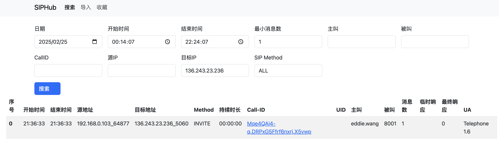
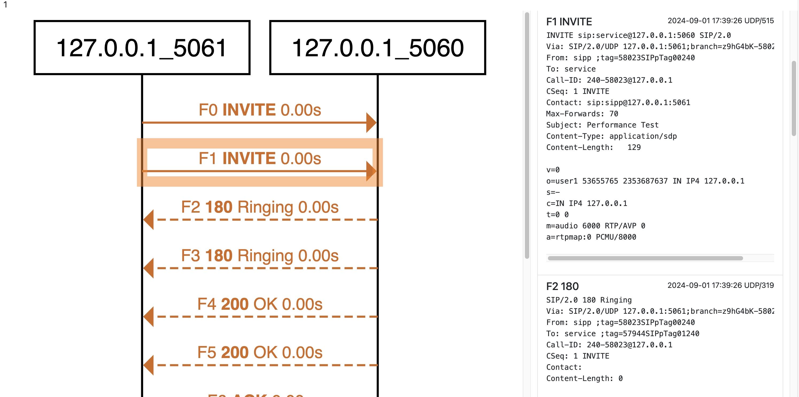
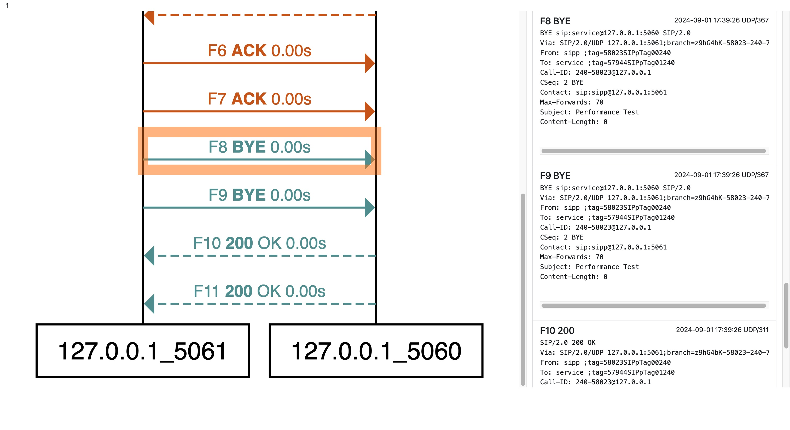
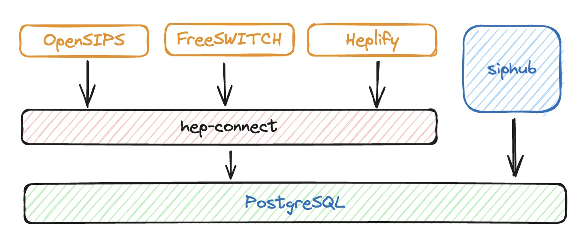

# siphub功能介绍

**为什么不直接用homer?**

首先说一下，我是用过homer的。但是在使用过程中，我发现如下问题。

1. 安装麻烦，这个可以忍
2. 经常按照主被叫号码查不到我想要的呼叫，查询页面经常时间错乱，这个忍不了
3. 查询的页面每一行代表一个SIP消息，而不是一个呼叫，出现的条目太多


**为什么我开发siphub？**

1. 安装要方便，只使用siphub和hep-connect两个容器
2. 查询页面要简单，我只做了两个页面，查询呼叫页、时序图展示页。我甚至都没有做登录界面，因为我觉得不需要
3. 数据展示要直观，表格的每一行代表一个呼叫的所有信令，而不是一条信令


# 截图

**搜索页面展示**




**时序图展示页面**

- 点击时序图的连线，对应原始消息会滚动到界面可视区域
- 点击原始消息，同时也会高亮对应连线，并滚动到可视区域
- 所有请求消息使用实线
- 所有响应消息使用虚线
- 相同的SIP事务的线条颜色相同
- 时序图显示的内容为：`F序号 SIP请求/状态码 [原因] 信令时间差`





# Roadmap

- [x] 时序图搜索
- [x] 时序图展示
- [x] 分表
- [x] 数据保留天数设置
- [ ] 收藏
- [ ] 导入pcap
- [ ] 导入json
- [ ] 导出json
- [ ] AB Call-leg关联

## 依赖

- PostgreSQL 16

# 部署

## docker 部署

```shell
docker run -d --name=siphub \
    -e DBUser=root \
    -e DBPasswd=mypass \
    -e DBAddr=1.2.3.4 \
    -e DBPort=5432 \
    -e DBName=postgres \
    -e dataKeepDays=10 \
    -p 3000:3000 \
    ghcr.io/wangduanduan/siphub:latest
```

**启动环境变量说明**

- DBUser: 数据库用户名， 默认wangduanduan
- DBPasswd: 数据库密码
- DBAddr: 数据库地址，默认127.0.0.1
- DBPort: 数据库端口，默认5432,
- DBName: 数据库名，默认postgres,
- LogLevel: 日志级别, 默认debug
- QueryLimit: 一次性查询的行数，默认10
- dataKeepDays: 数据保留几天，默认3

# 架构图

- OpenSIPS、FreeSWITCH、Heplify 将SIP消息以HEP格式写入到hep-connect
- hep-connect将消息写入数据库， hep-connect部署文档参考 https://github.com/wangduanduan/hep-connect 
- siphub提供web查询界面，负责从数据库查询和展示SIP消息

