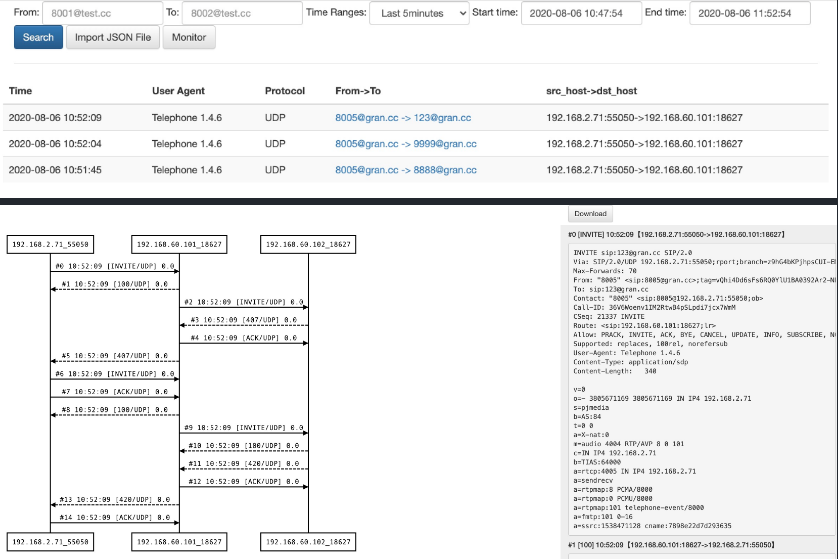

# Golang版本
- 开发中 
- 仅支持hep3协议

# roadmap
- [x] 增加日志模块 
- [x] 增加环境变量解析模块 
- [x] 增加SIP消息解析模块，只解析必要的字段 
- [x] 增加数据库链接模块 
- [x] 增加数据库写入模块
- [ ] 增加建表模块 
- [ ] 增加定时任务模块，定时建表和删表
- [ ] 增加统计模块， 按照请求方法，响应状态码， 接受消息量等进行统计
- [ ] 增加普罗米修斯监控模块
- [ ] 增加缓存模块，单个CallID的记录短时间内只写入一条，降低数据库压力
- [ ] 增加sip消息查询等rest api
    - SIP消息查询接口
    - 按照CallID查询相关的SIP消息接口
    - 按照SIP CallID查询FS CallID接口
- [ ] 增加webserver
- [ ] 优化信令图展示，同时展示两个callLeg

# 功能介绍

sip-hub是一个专注sip信令的搜索以及时序图可视化展示的服务。

相比于Homer, sip-hub做了大量的功能简化。

- 支持主叫精确查询
- 支持被叫后缀查询
- 支持按照域名查询
- 支持按照请求方法查询
- 支持SIP信令图展示
- 支持SIP信令图导入导出
- 支持关联两个FreeSWITCH Call-leg 
- 提供简单的统计值页面

sip-hub服务仅有3个页面

- 搜索页面: 用于按照主被叫、域名和时间范围搜索呼叫记录
- 时序图展示页面: 用于展示SIP时序图和原始SIP消
- 监控页面

# 环境变量说明

变量名 | 说明 | 默认值 | 可选值
--- | --- | --- | ---
UDPListenPort | UDP监听端口 | 9060
MaxPackgeLength | 最大UDP包字节 | 2048
MaxReadTimeoutSeconds | UDP读取超时分钟 | 默认5
LogLevel | 日志级别 | debug | debug, info, warning, error
HeaderUIDName | UID消息头的名字 siphub解析这个头来关联两个呼叫 | "" 
HeaderFSCallIDName | FSCallID消息头的名字，用来读取FS CallID | ""
DiscardMethods | 丢弃的SIP消息类型 | OPTIONS,REGISTER |
MinPackgeLength | 最小的SIP消息长度 | 24
SqlMaxOpenConn | 数据库连接池大小 | 默认24
DBUserPasswd | 数据库用户名和密码，格式如user:passswd |
DBAddr | 数据库地址, 格式如IP:PORT | 
DBName |  数据库名 | siphub
CalleeFrom | 被叫号码来自 | RURI, | RURI,FROM
DataKeepDays | 数据保存天数 | 2 

# 相关截图




# 安装

1. 首先需要安装MySql数据库，并在其中建立一个名为siphub的数据库
2. 运行
	- dbHost 数据库地址
	- dbUser 数据库用户
	- dbName 数据库名
	- dataKeepDays 抓包保存天数
	- 3000端口是web页面端口
	- 9060是hep消息收取端口

```bash
docker run -d -p 3000:3000 -p 9060:9060/udp \
--env NODE_ENV=production \
--env dbHost=1.2.3.4 \
--env dbUser=root \
--env dbPwd=123456 \
--env dbName=siphub \
--env dataKeepDays=3 \
--env logLevel=error \
--log-opt max-size=10M \
--log-opt max-file=3 \
--name siphub wangduanduan/siphub
```

# 集成

## OpenSIPS集成
test witch OpenSIPS 2.4

```bash
# add hep listen
listen=hep_udp:your_ip:9061

loadmodule "proto_hep.so"
# replace SIP_HUB_IP_PORT with siphub‘s ip:port
modparam("proto_hep", "hep_id","[hep_dst] SIP_HUB_IP_PORT;transport=udp;version=3") 
loadmodule "siptrace.so"
modparam("siptrace", "trace_id","[tid]uri=hep:hep_dst")

# add ite in request route();
if(!is_method("REGISTER") && !has_totag()){
  sip_trace("tid", "d", "sip");
}
```

## FreeSWITCH集成
fs version 版本要高于 1.6.8+ 

编辑： sofia.conf.xml

用真实的siphub ip:port替换SIP_HUB_IP_PORT

```
<param name="capture-server" value="udp:SIP_HUB_IP_PORT"/>
```

```
freeswitch@fsnode04> sofia global capture on
 
+OK Global capture on
freeswitch@fsnode04> sofia global capture off
 
+OK Global capture off
```
