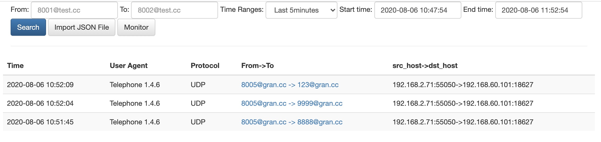
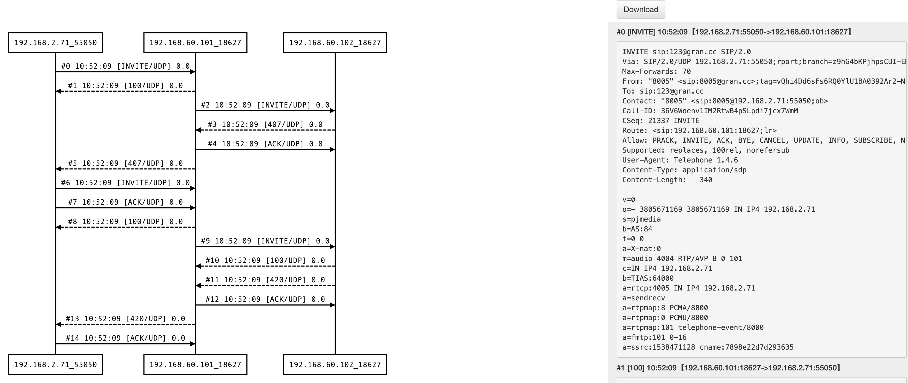

# 功能介绍
sip-hub是一个专注sip信令的搜索以及时序图可视化展示的服务。

相比于Homer, sip-hub做了大量的功能简化。同时也提供了一些个性化的查询，例如被叫后缀查询，仅域名查询等等。

sip-hub服务仅有3个页面

- sip消息搜索页面，用于按照主被叫、域名和时间范围搜索呼叫记录
- 时序图展示页面，用于展示SIP时序图和原始SIP消息
- 可以导入导出SIP消息
- 可以查找A-Leg
- 监控功能

做siphub的原因是homer太难用了，经常查不到想查的数据，查询的速度也蛮。

# 相关截图




# 安装

1. 首先需要安装MySql数据库，并在其中建立一个名为siphub的数据库
2. 运行
	- dbHost 数据库地址
	- dbUser 数据库用户
	- dbName 数据库名
    - dbPort 数据库端口号，可不填，默认为3306
	- dataKeepDays 抓包保存天数
	- 3000端口是web页面端口
	- 9060是hep消息收取端口

```bash
docker run -d -p 3000:3000 -p 9060:9060/udp \
--env NODE_ENV=production \
--env dbHost=1.2.3.4 \
--env dbUser=root \
--env dbPwd=123456 \
--env dbName=siphub \
--env dbPort=13309 \
--env dataKeepDays=3 \
--env logLevel=error \
--log-opt max-size=10M \
--log-opt max-file=3 \
--name siphub wangduanduan/siphub
```

# 集成

## OpenSIPS集成
test witch OpenSIPS 2.4

```bash
# add hep listen
listen=hep_udp:your_ip:9061

loadmodule "proto_hep.so"
# replace SIP_HUB_IP_PORT with siphub‘s ip:port
modparam("proto_hep", "hep_id","[hep_dst] SIP_HUB_IP_PORT;transport=udp;version=3") 
loadmodule "siptrace.so"
modparam("siptrace", "trace_id","[tid]uri=hep:hep_dst")

# add ite in request route();
if(!is_method("REGISTER") && !has_totag()){
  sip_trace("tid", "d", "sip");
}
```

## FreeSWITCH集成
fs version 版本要高于 1.6.8+ 

编辑： sofia.conf.xml

用真实的siphub ip:port替换SIP_HUB_IP_PORT

```
<param name="capture-server" value="udp:SIP_HUB_IP_PORT"/>
```

```
freeswitch@fsnode04> sofia global capture on
 
+OK Global capture on
freeswitch@fsnode04> sofia global capture off
 
+OK Global capture off
```

