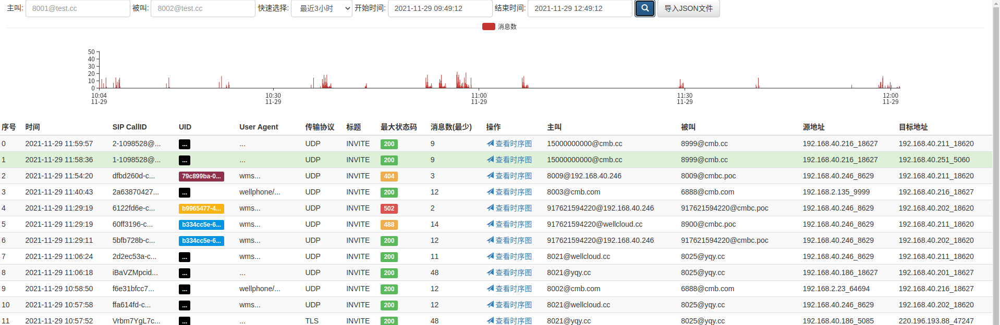
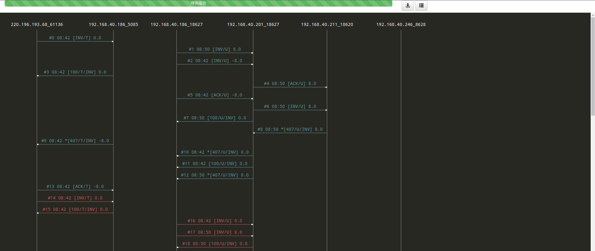
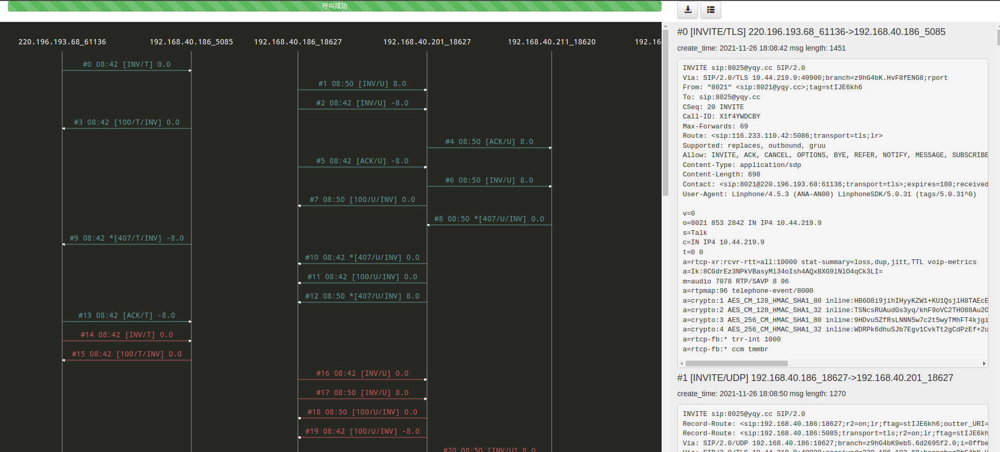

# 相关截图

## 搜索界面

- 搜索页面支持主叫和被叫以及时间范围进行搜索
    - 主叫精确查询；可以不带域名搜索，8001；也可以带域名搜索,8001@test.cc; 也可以只搜搜域名，如@test.cc
    - 被叫是后缀匹配查询； 可以带域名; 也可以不带域名； 也可以只带域名查询
- UID颜色相同表示为两个相关的call-leg
- 搜索栏目下面是当前搜索时间范围内，按秒统计的每秒接收的消息量
- 紧接着是一个表格，有以下字段
    - 序号： 最多到200
    - 时间
    - sip callID: sip信令中的callid
    - UID： 两个相关的call-leg id
    - User-Agent
    - 传输层协议： 如 UDP/TCP/TLS/WS/WSS等等
    - 标题： 一般是SIP请求名
    - 最少消息量： 相同callID的消息的数量
    - 操作： 点击之后可以查看时序图



## 时序图展示界面
- 时序图展示页面默认不会显示具体的SIP信令原始消息
- 状态栏上左边是一个进度条
    - 蓝色进度条表示INVITE成功
    - 红色进度条表示INVITE失败
- 左边是下载按钮，点击之后可以下载json格式的sip消息
- 左边是查看原始信令的按钮，点击之后原始信令图在页面右边展现

**信令图查看技巧**

- 颜色相同的时序图线条表示是相同的事务，具有相同的CSeq
- 点击某个时序图线条，在右边原始信令出现的情况下，会自动跳转
- 每条信令图上有以下几个字段
    - 序号
    - 分钟:秒钟
    - [sip消息的前三个字符/sip响应状态码/传输协议/sip响应的sip消息]
    - 上一个信令的时间差




# siphub 组件
- siphub-go: 负责处理hep消息，写入数据库 
- siphub-ui: 负责web界面展示，数据搜索

# Golang版本

- 仅支持hep3协议

# 功能介绍

## siphub-go

docker 安装siphub-go

```bash
    docker run -d \
    --name siphub-go \
    -p 3000:3000 \
    -p 9060:9060/udp \
    -e DBAddr="localhost" \
    -e DBUserPasswd="root:password" \
    -e DBName="siphub" \
    -e LogLevel="info" \
    -e HeaderUIDName="X-UID" \
    wangduanduan/siphub-go:21.12.16
```

- 3000/HTTP 端口
    - GET /metrics/prometheus 提供普罗米修斯统计的监控接口
- 9060/UDP hep消息接收端口

- siphub-go环境变量说明

```
    // UDP监听端口
	UDPListenPort         int    `env:"UDPListenPort" envDefault:"9060"`
    // 最大UDP包的长度
	MaxPackgeLength       int    `env:"MaxPackgeLength" envDefault:"2048"`
    // UDP读取超时秒数
	MaxReadTimeoutSeconds int    `env:"MaxReadTimeoutSecond" envDefault:"5"`
    // 日志级别
	LogLevel              string `env:"LogLevel" envDefault:"debug"`
    // 主机名称
	Hostname              string `env:"HOSTNAME" envDefault:"unknow"`
    // 关联两个Leg的UID SIP头名称
	HeaderUIDName         string `env:"HeaderUIDName"`
    // FS CallID名称 
	HeaderFSCallIDName    string `env:"HeaderFSCallIDName"`
    // 丢弃的方法，方法之间用英文逗号隔开
	DiscardMethods        string `env:"DiscardMethods" envDefault:"OPTIONS"`
    // 最小的UDP包长度，比这个小的会丢弃
	MinPackgeLength       int    `env:"MinPackgeLength" envDefault:"24"`
    // 数据库连接数
	SqlMaxOpenConn        int    `env:"SqlMaxOpenConn" envDefault:"24"`
    // 数据库用户名和密码
	DBUserPasswd          string `env:"DBUserPasswd" envDefault:"root:123456"`
    // 数据库地址
	DBAddr                string `env:"DBAddr" envDefault:"localhost"`
    // 数据库名称
	DBName                string `env:"DBName" envDefault:"siphub"`
    // 被叫号码从哪个地方抽取，RURI 或者 TO
	CalleeFrom            string `env:"CalleeFrom" envDefault:"RURI"`
```


## siphub-ui

docker运行siphub-ui

- dbHost="localhost" 数据库地址
- dbUser="root" 数据库用户
- dbPwd="some-password" 数据库密码
- dbName="siphub" 数据库名
- logLevel="info" 日志级别
- dataKeepDays="2" 数据保存多少天

```bash
    docker run -d \
    --name siphub-ui \
    -p 8080:8080 \
    -e NODE_ENV="production" \
    -e dbHost="localhost" \
    -e dbUser="root" \
    -e dbPwd="some-password" \
    -e dbName="siphub" \
    -e logLevel="info" \
    -e dataKeepDays="2" \
    wangduanduan/siphub-ui:21.12.17
```

- 8080/HTTP 端口 提供Web查询和展示界面

# 集成

## OpenSIPS集成
test witch OpenSIPS 2.4

```bash
# add hep listen
listen=hep_udp:your_ip:9061

loadmodule "proto_hep.so"
# replace SIP_HUB_IP_PORT with siphub‘s ip:port
modparam("proto_hep", "hep_id","[hep_dst] SIP_HUB_IP_PORT;transport=udp;version=3") 
loadmodule "siptrace.so"
modparam("siptrace", "trace_id","[tid]uri=hep:hep_dst")

# add ite in request route();
if(!is_method("REGISTER") && !has_totag()){
  sip_trace("tid", "d", "sip");
}
```

## FreeSWITCH集成

fs version 版本要高于 1.6.8+ 

编辑： sofia.conf.xml

用真实的siphub ip:port替换SIP_HUB_IP_PORT

```
<param name="capture-server" value="udp:SIP_HUB_IP_PORT;hep=3;capture_id=100"/>
```

```
freeswitch@fsnode04> sofia global capture on
 
+OK Global capture on
freeswitch@fsnode04> sofia global capture off
 
+OK Global capture off
```

然后将下面两个文件的sip-capture设置为yes
- sofia_internal.conf.xml
- sofia_external.conf.xml


```
<param name="sip-capture" value="yes"/>
```

最后，建议重启一下fs.

## heplify集成

参考 https://github.com/sipcapture/heplify

heplify是一个go语言开发的，基于网卡抓包的方式，捕获sip消息的客户端程序，整个程序就是一个二进制文件，可以不依赖其他组件运行。

- -i 指定网卡。需要更具机器真实网卡进行修改
- -m SIP 指定抓SIP消息
- -hs 指定siphub-go的地址。需要根据siphub-go的真实地址进行修改
- -p 指定生成日志文件的位置
- -dim 排除某些类型的SIP包，例如排除OPTIONS和REGISTER注册的包
- -pr 指定抓包的端口范围。

```
nohup ./heplify -i eno1 \
  -m SIP \
  -hs 192.168.3.3:9060 \
  -p "/var/log/" \
  -dim OPTIONS,REGISTER \
  -pr "5060-5061" &
```
