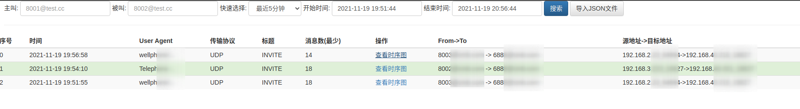
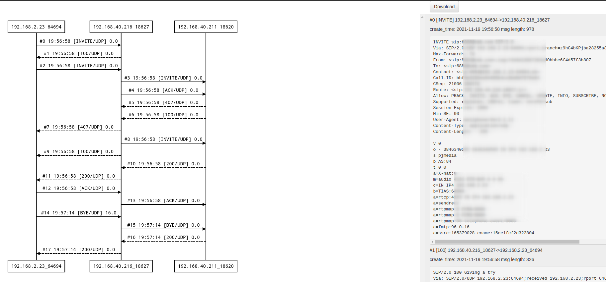

# 相关截图

## 搜索界面


## 时序图展示界面


# siphub 组件
- siphub-go: 负责处理hep消息，写入数据库 
- siphub-ui: 负责web界面展示，数据搜索

# Golang版本

- 仅支持hep3协议

# 功能介绍

sip-hub是一个专注sip信令的搜索以及时序图可视化展示的服务。

相比于Homer, sip-hub做了大量的功能简化。

- 支持主叫精确查询
- 支持被叫后缀查询
- 支持按照域名查询
- 支持按照请求方法查询
- 支持SIP信令图展示
- 支持SIP信令图导入导出
- 支持关联两个FreeSWITCH Call-leg 
- 提供简单的统计值页面

sip-hub服务仅有3个页面

- 搜索页面: 用于按照主被叫、域名和时间范围搜索呼叫记录
- 时序图展示页面: 用于展示SIP时序图和原始SIP消

# 环境变量说明

```
    // UDP监听端口
	UDPListenPort         int    `env:"UDPListenPort" envDefault:"9060"`
    // 最大UDP包的长度
	MaxPackgeLength       int    `env:"MaxPackgeLength" envDefault:"2048"`
    // UDP读取超时秒数
	MaxReadTimeoutSeconds int    `env:"MaxReadTimeoutSecond" envDefault:"5"`
    // 日志级别
	LogLevel              string `env:"LogLevel" envDefault:"debug"`
    // 主机名称
	Hostname              string `env:"HOSTNAME" envDefault:"unknow"`
    // 关联两个Leg的UID SIP头名称
	HeaderUIDName         string `env:"HeaderUIDName"`
    // FS CallID名称 
	HeaderFSCallIDName    string `env:"HeaderFSCallIDName"`
    // 丢弃的方法，方法之间用英文逗号隔开
	DiscardMethods        string `env:"DiscardMethods" envDefault:"OPTIONS"`
    // 最小的UDP包长度，比这个小的会丢弃
	MinPackgeLength       int    `env:"MinPackgeLength" envDefault:"24"`
    // 数据库连接数
	SqlMaxOpenConn        int    `env:"SqlMaxOpenConn" envDefault:"24"`
    // 数据库用户名和密码
	DBUserPasswd          string `env:"DBUserPasswd" envDefault:"root:123456"`
    // 数据库地址
	DBAddr                string `env:"DBAddr" envDefault:"localhost"`
    // 数据库名称
	DBName                string `env:"DBName" envDefault:"siphub"`
    // 被叫号码从哪个地方抽取，RURI 或者 TO
	CalleeFrom            string `env:"CalleeFrom" envDefault:"RURI"`
    // 数据保留多少小时
	DataKeepHours         int    `env:"DataKeepHours" envDefault:"2"`
```


# 集成

## OpenSIPS集成
test witch OpenSIPS 2.4

```bash
# add hep listen
listen=hep_udp:your_ip:9061

loadmodule "proto_hep.so"
# replace SIP_HUB_IP_PORT with siphub‘s ip:port
modparam("proto_hep", "hep_id","[hep_dst] SIP_HUB_IP_PORT;transport=udp;version=3") 
loadmodule "siptrace.so"
modparam("siptrace", "trace_id","[tid]uri=hep:hep_dst")

# add ite in request route();
if(!is_method("REGISTER") && !has_totag()){
  sip_trace("tid", "d", "sip");
}
```

## FreeSWITCH集成

fs version 版本要高于 1.6.8+ 

编辑： sofia.conf.xml

用真实的siphub ip:port替换SIP_HUB_IP_PORT

```
<param name="capture-server" value="udp:SIP_HUB_IP_PORT;hep=3;capture_id=100"/>
```

```
freeswitch@fsnode04> sofia global capture on
 
+OK Global capture on
freeswitch@fsnode04> sofia global capture off
 
+OK Global capture off
```

然后将
- sofia_internal.conf.xml
- sofia_external.conf.xml


```
<param name="sip-capture" value="yes"/>
```
