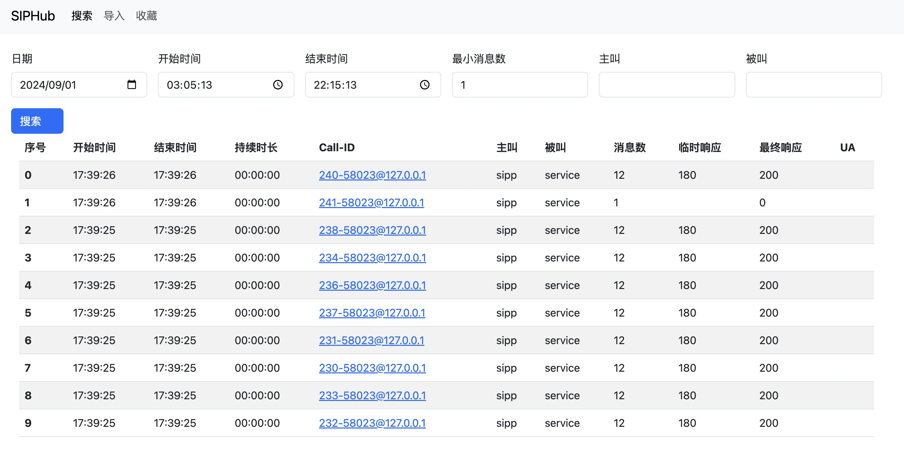

# siphub功能介绍

# 截图

**搜索页面展示**

**时序图展示页面**

# 功能列表

- [x] 时序图搜索
- [x] 时序图展示
- [ ] 分表
- [ ] 收藏
- [ ] 导入pcap
- [ ] 导入json
- [ ] 导出json
- [ ] AB Call-leg关联

## 依赖

- PostgreSQL 16

# 架构图

- OpenSIPS、FreeSWITCH、Heplify 将SIP消息以HEP格式写入到hep-connect
- hep-connect将消息写入数据库， hep-connect部署文档参考 https://github.com/wangduanduan/hep-connect 
- siphub提供web查询界面，负责从数据库查询和展示SIP消息

